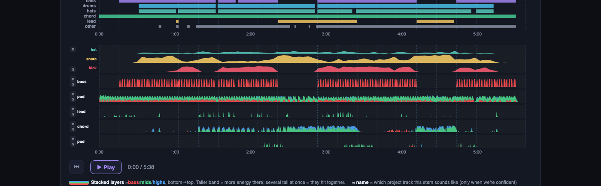
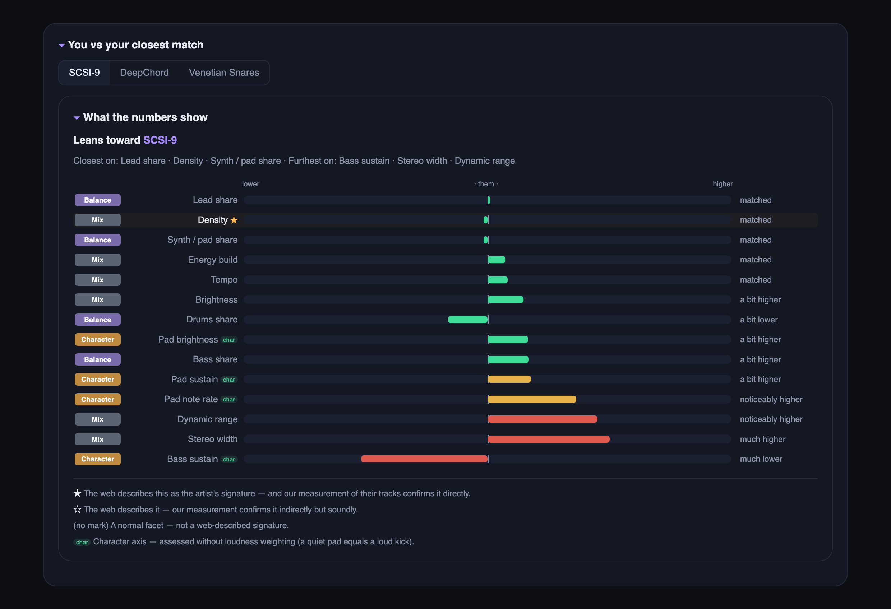
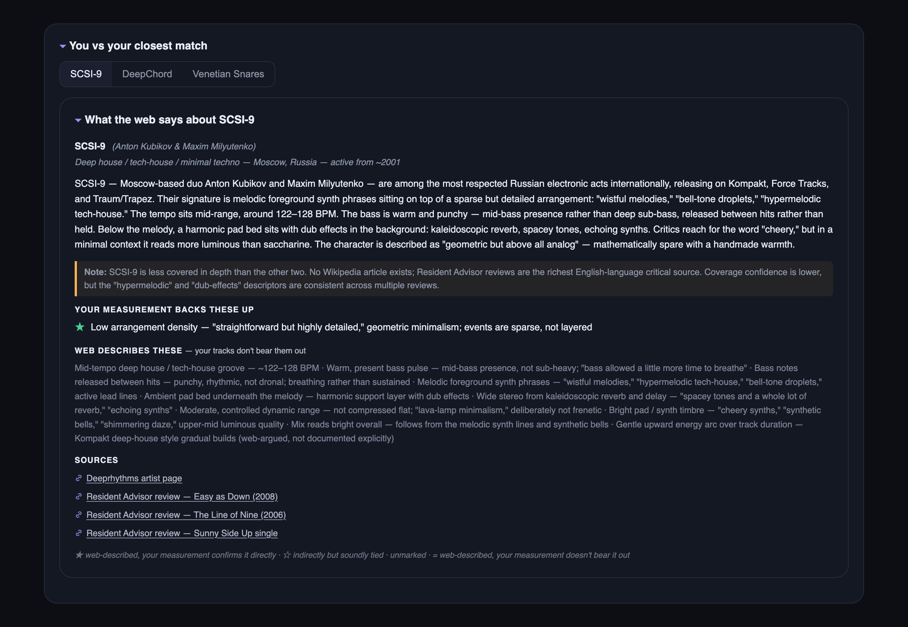

# track-coach

**A compositional coach for music producers — a [Claude Code](https://claude.com/claude-code) skill that hears what's really in your track.**

*macOS (v1) · runs entirely on your machine · version in every page footer and in [`CHANGELOG.md`](CHANGELOG.md)*


Point it at a bounce — and your Ableton project, if you have it — and it lays the whole track out on one page you can hear. It tells you what's actually going on, in the concrete: *bass masks the mids in 250–500 Hz through bars 8–24*; *the cutoff automation ends at 2:45 while the sound keeps opening to 3:10*. Every claim traces back to a measurement, and the creative call stays yours. Built hands-on, for my own music.

---

## What it does

### Hear what you're looking at

Every chart is wired to the audio: click a moment on any curve and the track plays from there. Each stem gets its own lane — solo it, mute it, watch its low / mid / high bands move — so you hear exactly what each part is doing, right where you're looking.



### Keep every version

Every run is kept under its own version and date. The library lists everything you've analysed — one row per track, on its newest version, with its spectral signature, vitals, and mood / style tags, sortable and searchable — and each track holds its full history on its own page, so today's bounce opens right next to last month's and you can see what moved. The library keys a track on its filename, so one song saved under two names (a rename, a differently-named bounce) shows up as two rows. You can tell it they are one song: `library.py alias --merge <this-name> --into <keep-this-name>` folds them into one row, and both sets of bounces stay listed as versions. `alias --list` shows your merges; `alias --remove <name>` undoes one. Nothing merges on its own; only you know two filenames are the same track.


### Place it among your music

A full run sets the track in context, in one panel: *You vs your closest match*. It names the reference directions the track leans toward — artists you've analysed, up to three tabs — and reads the one you pick facet by facet. It also finds the nearest siblings in your own library, so you can see which of your tracks this one sits closest to: handy for a set, a transition, or an honest A/B. Every listed neighbour — in the catalog's "similar in your library" column and in the reference "leans toward" column — carries a small three-dot mark beside its colour: ●●● close, ●●○ medium, ●○○ far. The mark reads the same in greyscale, in print, and to colour-blind eyes. The read stays observation; the call stays yours. And the library links straight into it: click a direction name in the catalog and the track's page opens right on that comparison. When there's nothing close to show — no direction near, or a run with no comparison data — the panel doesn't vanish: it stays in its place as a quiet one-liner saying exactly that.



Below the bars, the same panel tells you what the wider world hears in the direction you picked — genre, era, signature moves — every claim cross-checked against your own measurements of their tracks: ★ means the web's description is confirmed directly by the numbers, ☆ indirectly, and what the numbers don't bear out is said so, plainly. Switch tabs and the web read follows. Sources are linked, so you can read further.



*Similarity comes with the full analysis — a quick read has no fingerprint to compare.*

---

## Quick start

Get the skill into Claude Code's skills folder and run the installer once:

```bash
git clone https://github.com/happysasha18/track-coach.git ~/.claude/skills/track-coach
bash ~/.claude/skills/track-coach/setup.sh
```

`setup.sh` is safe to re-run — it checks each dependency (Homebrew, ffmpeg, uv, Python 3.11), installs what's missing, and copies the `/tc` and `/tc-quick` commands into your Claude commands folder, printing the exact fix if anything trips. Details in [`references/install_troubleshooting.md`](references/install_troubleshooting.md).

Then open Claude Code and either run a command:

| Command | What it does |
|---|---|
| `/tc` | Full analysis — stems, the synced player, similarity, all evidence. A few minutes. |
| `/tc-quick` | Quick read — the track's shape, vitals, and top observations. Seconds, and you can grow it into a full run later. |

— or just talk about your track:

> *"why does my track sound stuck?"* · *"analyse this project"* · *"compare these two versions"*

Point it at a project folder and it finds the latest render and the `.als` itself, checking with you before it assumes anything that matters.

---

## The page it builds

The player and the reference read above are two panels on one page. The rest:

**Arrangement.** The real project arrangement straight from the `.als` — MIDI blocks (brightness = note density), audio-clip strips, and labelled locators — aligned to the rendered audio, on the same timeline as the player. Ground truth from the project.


**Intention vs. result.** Your automation envelopes — filter, gain, pitch, sends — each on its own scale, plotted against the measured brightness arc, so a curve that flattens while the sound keeps moving shows up as a gap.

**Stem ↔ project map.** Each separated stem is matched to the real project tracks by envelope similarity; confident matches are named, quiet ones labelled by their frequency range.

**Recommendations.** A short ranked list, most important first — each card carries the measurement behind it and one concrete move. In Detailed, an Order control flips the cards between By urgency (fix-first) and By time (the order the moments happen, matching the a/b/c letters on the timeline); your choice is remembered. Clicking a card takes you to the panel its evidence lives in — the tonal bars, the master's numbers, the drum timing, the automation envelopes — and timecoded cards also seek the player to their moment. It works both ways: on the story graph, clicking a lettered moment lights the card that talks about it.

**Producer's read.** A plain-language account of how the track develops: which dimensions trend (louder, brighter, busier, wider) and which sit idle.

Content panels collapse; the Evidence drawer (arrangement, stem map, rhythm, notes) sits closed until you want the depth — tonal balance sits above it, always visible. Three views on one ladder — Quick, Simple, Detailed — each adds to the last, and the page remembers which you used.

| View | What you see |
|---|---|
| **Quick read** | Vitals, structure bar + power curve, single-track mix player, producer's read, top recommendations. Fast — no stem separation. |
| **Simple** (default, full analysis) | Everything in Quick, plus the synced multi-stem player. The Evidence drawer sits closed. |
| **Detailed** | Adds the player lanes, the modulation and stereo-width curves, and the full recommendation list. Mute / solo live here. |

**When an analysis could not finish.** If a run fails or is still going, the track's page says so plainly, with a plain next step. It shows a short "Got this far" list — which steps finished, which were never reached — and the actual error underneath. It names the source file, filename and full path, with a Copy button, so you can paste the path straight into Finder or a terminal. A finished track's page is unchanged.

---

## Why it exists

It began with one word from a DJ friend I'd handed a track to: **raw**. She couldn't tell what the track was reaching for — the elements never came together into a picture. That's the gap track-coach was built to close: measure the signals and *show how a track is actually heard* — its shape, its style — instead of guessing at it. So it reports only what `librosa` and `Demucs` actually measure; the orchestration just conducts, and all the work lives in deterministic scripts, so the same track gives the same answer every time.

The read stays in three layers: **measured** (exact numbers), **what it means** (a concrete reading — *bass dominates 250–500 Hz for the first two minutes, mids present but buried*), and **your call** (the decision is yours). Built for my own music as **[Total Reboot](https://totalreboot.com)** — more at [github.com/happysasha18](https://github.com/happysasha18).

---

## What it measures

**From the audio:**

- Energy, brightness, density, modulation and stereo-width arcs over time; section structure (self-similarity / recurrence)
- Stem separation — up to 6 stems; per-stem character labels derived from measurement (`kick`, `bass`, `lead`, `chord`, `pad`…)
- Frequency masking between stems (*bass masks mid in 250–500 Hz during bars 8–24*)
- Per-stem rhythm: onset density, timing, syncopation, separation confidence
- Drum-hit breakdown: kick / snare / hat density in the drums stem
- Note transcription: pitch content per stem, polyphony, mono vs chord character
- Vitals: tempo, key/scale, length, LUFS, true-peak dBTP, dynamic range, stereo width, phase correlation

**From the Ableton `.als` (when provided):**

- Every arrangement track: MIDI clips (note density → brightness) and audio clips, aligned to the rendered audio
- Automation envelopes by target parameter (filter cutoff, gain, pitch, sends…)
- Locators and time-signature changes
- The render offset — which locator the bounce starts from — so project time and audio time line up

Reference directions are measured fingerprints too: web-described style traits are cross-checked against measurement — ★ confirmed directly, ☆ confirmed indirectly. The web suggests; measurement decides.

---

## Where things live

Each run is a self-contained HTML file, versioned and timestamped, kept under `~/.track-coach/projects/<track-slug>/` — outside your Ableton project folders, so a folder tidy-up leaves it alone. The player reads its co-located `stems_web/` folder; everything else is embedded in the page.

Every finished widget deposits to the global library at `~/.track-coach/library/`. Its catalog page gives a sortable, searchable row per track (its newest version; older versions live on each track's own page) — signature, vitals, tags, and a one-button preview player. Open it with `scripts/library.py catalog --open`.

---

## Under the hood

| | |
|---|---|
| `SKILL.md` | Orchestration — how Claude runs the pipeline and writes the read |
| `scripts/track_analyzer.py` | One-command entrypoint: `analyze` (measure) then `build` (render) |
| `scripts/` | Analysis units: `analyze_core`, `analyze_detail`, `masking`, `separate` (Demucs), `parse_als`, `self_similarity`, `transcribe` (basic-pitch), `rhythm_quality`, `drum_breakdown`, `map_stems`, `make_web_stems`, `build_widget`, `library` |
| `data/reference_web_notes.json` | One source for reference web notes (widget panel + side page) |
| `tests/` | Regression suite (run with `pytest` inside the project's pinned `uv` environment) — asserts on the real rendered HTML |
| `references/` | `methodology.md`, `interpretation.md`, `install_troubleshooting.md` |
| `docs/` | Screenshots, `SPEC.md`, `TEST_MATRIX.md` |
| `setup.sh` · `requirements.txt` | Environment setup, pinned deps |

Built on [`librosa`](https://librosa.org) (analysis), [Demucs](https://github.com/facebookresearch/demucs) (stem separation), [basic-pitch](https://github.com/spotify/basic-pitch) (note transcription), and `ffmpeg` — all run deterministically through [`uv`](https://github.com/astral-sh/uv).

---

## License

[MIT](LICENSE) © Alexander Abramovich — covers this repository's own orchestration and analysis code. Deep mode pulls in **Demucs** and **PyTorch**, which carry their own licenses; check those before any commercial or redistributive use.

---

*made with [live-spec](https://github.com/happysasha18/live-spec) v1.0.9.*
