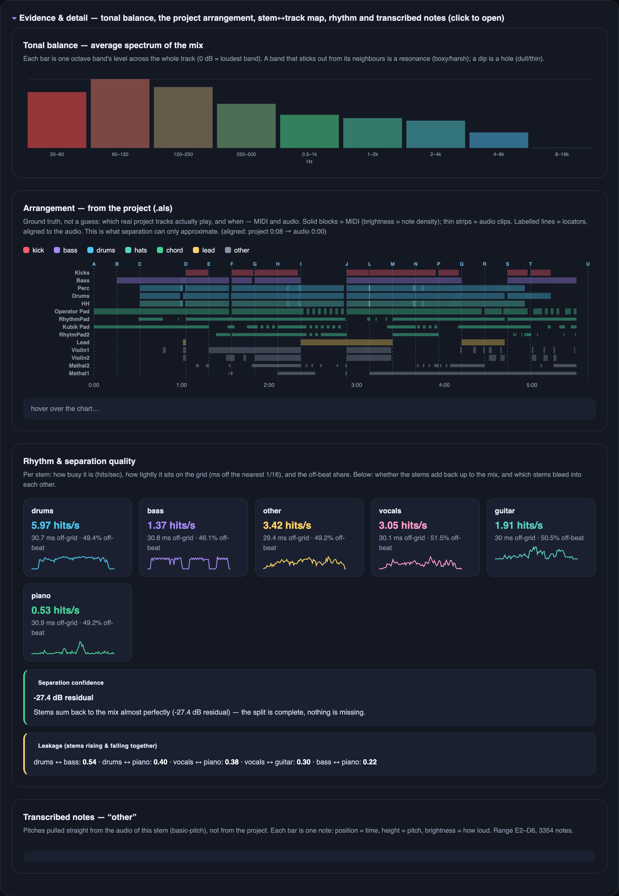

# track-coach

**A full-stack compositional coach for music producers — a [Claude Code](https://claude.com/claude-code) skill.**

> ⚡ **It's a Claude Code skill, not a standalone app.** Drop the folder into `~/.claude/skills/track-coach/`, run `./setup.sh` once ([details ↓](#install)), then just talk to Claude about your track — *"why does this sound stuck?"*, *"analyse this project"*.

Give it a track (and optionally your Ableton project), and it runs the complete analysis pipeline, then builds **one offline, self-contained HTML widget** with a synced multi-stem player, the real arrangement on a timeline, masking and rhythm diagnostics, and concrete, specific feedback — not "energy is low," but *"bass masks the mids in 250–500 Hz during bars 8–24"* and *"the cutoff automation ends at 2:45 but brightness keeps rising to 3:10."*

> **Status:** early / unstable (`v0.6.5`). macOS-first. Built and refined hands-on.


**Two views, one toggle.** It opens calm in **Simple** — the one-line verdict, the vitals spec-sheet, a colour-coded **structure bar** (a returning section keeps its colour *and* its letter, so reprises are obvious) over the power curve broken into its driving lanes (energy, brightness, density, modulation, stereo width), the synced multi-stem player, the Producer's read, and ranked feedback. Flip to **Detailed** to also open the **Evidence drawer** — every raw measurement behind the calls.

---

## Why it exists

It started when another AI flat-out hallucinated about one of my tracks — wrong duration, an arc that didn't exist, made-up gear — and the real measurements proved it wrong. So I built a tool that **can't** lie: it reports only what `librosa` and `Demucs` actually measure. The orchestration just conducts; all the real work lives in deterministic scripts, so the same track gives the same answer every time instead of being re-improvised on a whim.

The output is split into three honest layers, and it never crosses the line between them:

```
measured  →  what it means  →  up to you
```

*Measured* — exact numbers only. *What it means* — specific, concrete interpretation (not "energy is low," but "bass dominates 250–500 Hz for the first two minutes, mids are present but buried"). *Up to you* — patterns observed, never directives. The author decides.

> Built for my own music as **[Total Reboot](https://totalreboot.com)**. More about me: [github.com/happysasha18](https://github.com/happysasha18).

---

## What it does

Everything runs by default — no need to ask for "deep mode":

- **Development-arc analysis** — energy, brightness, loudness (LUFS), and how the track evolves over time
- **Stem separation** (Demucs) — drums / bass / vocals / other, with a synced player (play / seek / mute / solo, playhead linked to every chart)
- **Frequency masking** — which stem buries which, in which band, during which bars
- **Per-stem rhythm + separation quality** — groove consistency and how cleanly each stem was isolated
- **Drum-hit breakdown** — kick / snare / hat detection and timing
- **Note transcription** — basic-pitch on the melodic content
- **Ableton `.als` parsing** — tracks, MIDI + audio clips, automation envelopes, locators
- **Intention vs. result** — reads your automation against what actually happened in the audio (e.g. a cutoff that stops moving while brightness keeps rising), surfaced as a recommendation
- **Demucs-stem ↔ real-track map** — connects separated stems back to your project's tracks
- **Self-similarity / form** — folds repeated sections into one colour-coded structure bar (a returning part keeps its colour + letter)

---

## A look at the output

| The stem player (Detailed view) | What to change, ranked |
|---|---|
|  |  |

<sub>**Left — the song decomposed:** the colour-coded structure bar and power curve over its driving lanes, then every stem on its own lane under one transport (play / seek / mute / solo, playhead linked to every chart). **Right — concrete feedback:** the few things that stood out, most important first — red = worth fixing, green = working, yellow = a creative choice. Specific and timestamped, never "energy is low."</sub>

### It reads your project, not just the audio

Point it at your Ableton set and it stops guessing. The arrangement comes straight from the `.als` — the ground truth that stem separation can only approximate.


<sub>**Arrangement, from the project:** which real tracks actually play, and when. Solid blocks = MIDI (brightness = note density), thin strips = audio clips, labelled lines = locators — all aligned to the rendered audio.</sub>

### Intention vs. result

Your automation is what you *meant* to happen; the audio is what *did*. Track Coach plots the real envelopes from the `.als` — filter, gain, pitch, sends — each scaled to its own range, against the measured brightness (the faint dashed line in every lane). Where a curve flattens but the sound keeps moving, intention and result have drifted apart.


<sub>**The "intention" layer:** real automation envelopes aligned to the audio, with the Brightness arc ghosted into each lane for direct comparison. It's where the *"the cutoff stops moving at 2:45 but brightness keeps rising to 3:10"* recommendation comes from — now you can see it, not just read it.</sub>

### Evidence & detail

Collapsed by default at the bottom of the Detailed view, one drawer holds everything it measured — the receipts behind every call above:



<sub>**The full drawer:** the mix's average spectrum (**tonal balance**), the real **arrangement** from the `.als`, the **stem ↔ track map** (does separation match the project?), per-stem **rhythm & separation quality**, and the **transcribed notes**. Nothing interpreted here — just the measurements the read is built on.</sub>

---

## Install

macOS (v1). Requires Python 3.11, `ffmpeg`, and the deps in `requirements.txt`.

```bash
./setup.sh
```

`setup.sh` is a short, readable bash script — skim it before you run it. It installs [Homebrew](https://brew.sh) (only if missing), `ffmpeg`, and [`uv`](https://github.com/astral-sh/uv), then the pinned Python deps. The single password prompt is Homebrew's own (your Mac login), and only fires if Homebrew isn't already there.

Prefer not to run it? Already have `ffmpeg` and a Python 3.11 env? Install the deps from `requirements.txt` yourself and skip the script entirely.

See [`references/install_troubleshooting.md`](references/install_troubleshooting.md) if anything fails.

---

## Usage

This is a **Claude Code skill** — drop the folder into `~/.claude/skills/track-coach/` and just talk to Claude about your track:

> *"why does my track sound stuck?"* · *"analyse this project"* · *"compare these two versions"*

Claude grabs the audio (and `.als` if available), runs the pipeline, and opens the widget. You can also point it at a whole project folder and it'll find the latest render and `.als` itself.

---

## What's new

**v0.6** (latest) — a substantial re-architecture:

- **One command runs the pipeline.** `track_analyzer.py analyze` measures (audio → `.als` → stems →
  masking/rhythm/drums/notes), then `build` renders the widget — a strict *measure → interpret →
  render* flow, so the read is written from real numbers, never fabricated.
- **One structure bar.** The two clashing form/scene rows are merged: named scenes (Intro/Build/Drop)
  coloured + lettered by the section that recurs, so a returning part shares its colour and letter.
- **Simple shows the substance.** The stem player, the Producer's read and all recommendations now
  live in the calm Simple view too; Detailed only adds the raw evidence drawer.
- **Nothing gets lost on rebuild.** Re-analysing a track carries its Producer's read / title / verdict
  forward; quick runs are labelled "quick read" (not "deep mode").
- **Global library.** Every build deposits its self-contained widget into `~/.track-coach/library/`;
  `library.py list` / `clean` browse and prune across projects.
- Backed by a **53-test suite** that guards against panels disappearing and reads being dropped.

→ **Full history in [CHANGELOG.md](CHANGELOG.md).**

---

## How it's built

| | |
|---|---|
| `SKILL.md` | Orchestration — how Claude runs the pipeline and writes the read-out |
| `scripts/track_analyzer.py` | The one-command engine — `analyze` (measure) and `build` (render once), driving every step below |
| `scripts/` | The analysis units (Python): `analyze_core`, `masking`, `separate`, `parse_als`, `self_similarity`, `build_widget`, … plus `library.py` (global widget library) and `tc_uv.sh`, the shell-agnostic dependency-pinned runner every step goes through |
| `tests/` | Dependency-free regression suite (`python3 -m unittest discover tests`) — pipeline plan, offset, build-input preservation, widget contract, library |
| `references/` | `methodology.md` (the conceptual framework), `interpretation.md` (numeric ranges), troubleshooting |
| `docs/` | Screenshots |
| `setup.sh` · `requirements.txt` | Environment setup, pinned deps |

---

## License

[MIT](LICENSE) © Alexander Abramovich — covers this repository's own orchestration and analysis code. Deep mode pulls in **Demucs** and **PyTorch**, which carry their own licenses; check those before any commercial or redistributive use.
