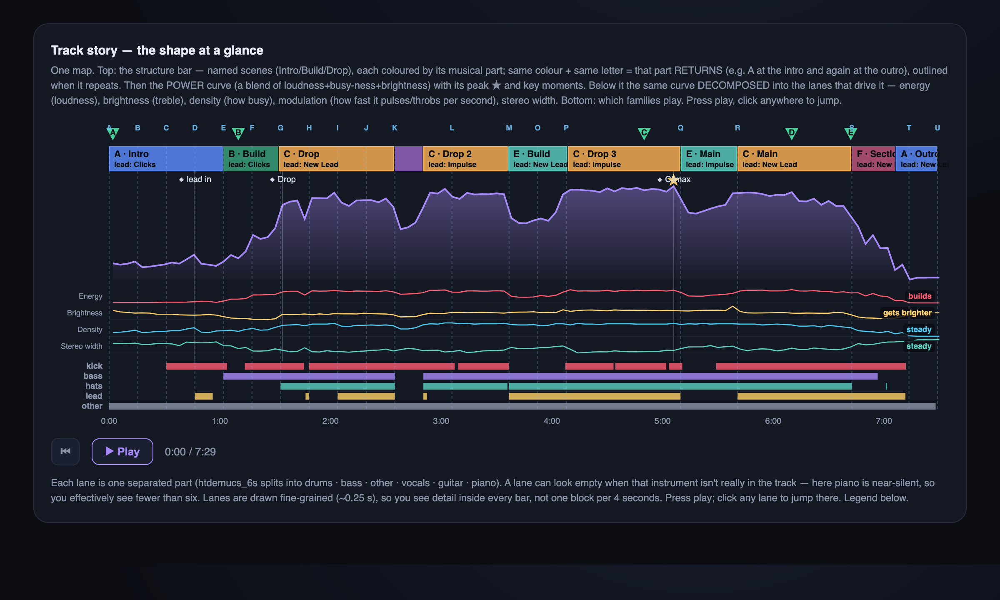
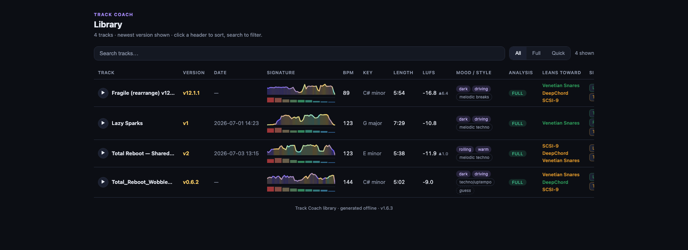
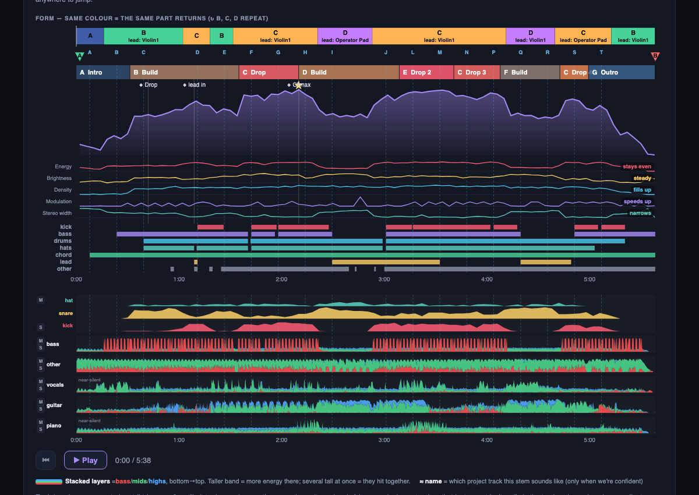
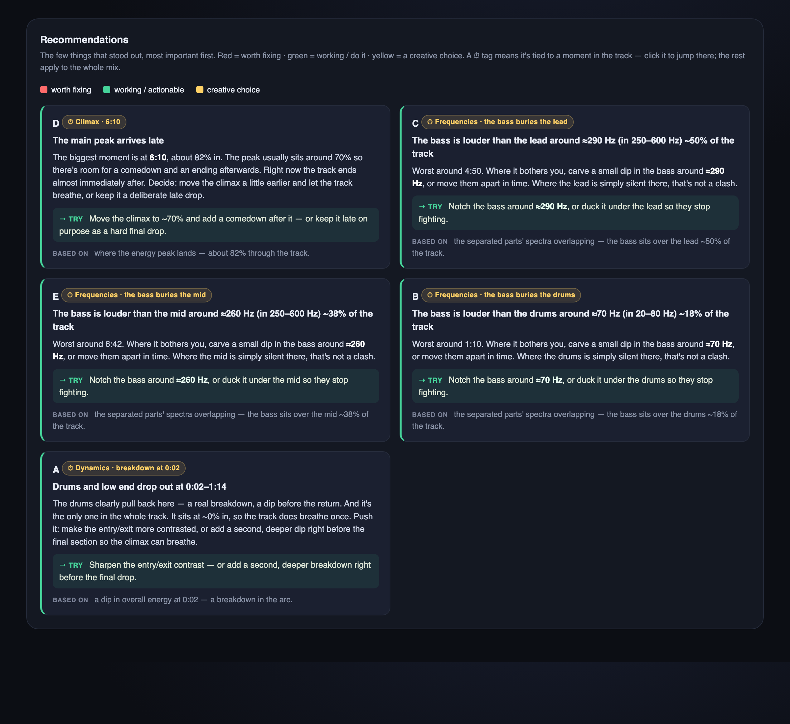
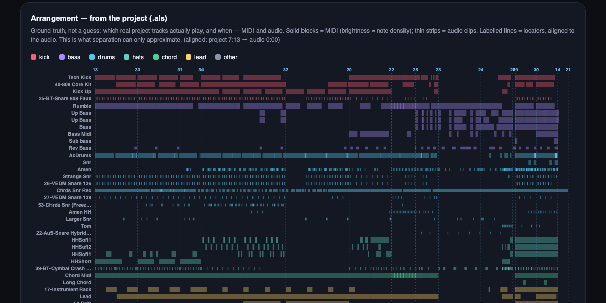
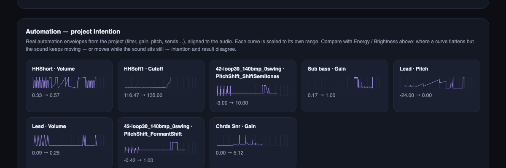

# track-coach

**A full-stack compositional coach for music producers — a [Claude Code](https://claude.com/claude-code) skill.**

> ⚡ **It's a Claude Code skill, not a standalone app.** Drop the folder into `~/.claude/skills/track-coach/`, run `./setup.sh` once ([details ↓](#install)), then just talk to Claude about your track — *"why does this sound stuck?"*, *"analyse this project"*.

Give it a track (and optionally your Ableton project), and it runs the complete analysis pipeline, then builds **one offline, self-contained HTML widget** with a synced multi-stem player, the real arrangement on a timeline, masking and rhythm diagnostics, and concrete, specific feedback — not *"energy is low,"* but *"bass masks the mids in 250–500 Hz during bars 8–24"* and *"the cutoff automation ends at 2:45 but brightness keeps rising to 3:10."*

> **Status:** early. macOS-first. Built and refined hands-on. <sub>(the exact version is printed in every widget's footer and tracked in [`CHANGELOG.md`](CHANGELOG.md) — not pinned here, so it can't drift)</sub>



---

## What you get

Everything runs by default — no need to ask for a "deep mode." You point it at a track; you get back one page that answers *what is this track, what's working, and what's holding it back* — with the receipts.

- **The song at a glance.** A one-line verdict, a spec-sheet of vitals (BPM, key, length, LUFS), and a colour-coded **structure bar** — a returning section keeps its colour *and* its letter, so reprises are obvious — over the power curve broken into the lanes that drive it (energy, brightness, density, modulation, stereo width).
- **Hear what you see.** A synced **multi-stem player** — play / seek / mute / solo, with the playhead linked to every chart. Click anywhere on a graph to jump there.
- **What to change, ranked — with the receipts.** The few things that stood out, most important first: red = worth fixing, green = working, yellow = a creative choice. Each card is tied to a moment in the track *and* shows what it's based on — the signal or the combination behind it — so it's a specific move, never a vague *"add more energy."*
- **A read of how the track moves.** Alongside the cards, a plain-language read of *how* the track develops — which dimensions actually grow (louder, brighter, busier, wider) and which sit idle — so you can see the shape of the arc, not just the numbers.
- **It reads your project, not just the audio.** Point it at your Ableton set and the arrangement, automation envelopes and locators come straight from the `.als` — ground truth that stem separation can only approximate.
- **Your whole catalog, one page.** Every analysis lands in a searchable **Library** of your body of work — one row per version, each with a spectral signature, the spec, and a **one-button player** so you can audition a track without even opening it.



<sub>**One row per version** (re-analyses of the same bounce collapse automatically, numbered v1…vN with LUFS/length/BPM deltas). Each row carries a **signature** — a spectral ribbon (height = energy, colour = brightness, weight = density) over a 9-band tonal strip — plus a **▶ preview player** whose scrubber rides the ribbon (click along the time-axis to seek), mood/style tags, the spec, and a **click on the track name** to open the full widget. Responsive (it sheds its least-important columns on a narrow window instead of clipping). Browse it offline; **← Library** in each widget brings you back.</sub>

---

## A look at the output

| The stem player (Detailed view) | What to change, ranked |
|---|---|
|  |  |

<sub>**Left — the song decomposed:** the colour-coded structure bar and power curve over its driving lanes, then every stem on its own lane under one transport (play / seek / mute / solo, playhead linked to every chart). **Right — concrete feedback:** the few things that stood out, most important first. Specific and timestamped, never "energy is low."</sub>

### It reads your project, not just the audio

Point it at your Ableton set and it stops guessing. The arrangement comes straight from the `.als` — the ground truth that stem separation can only approximate.



<sub>**Arrangement, from the project:** which real tracks actually play, and when. Solid blocks = MIDI (brightness = note density), thin strips = audio clips, labelled lines = locators — all aligned to the rendered audio.</sub>

### Intention vs. result

Your automation is what you *meant* to happen; the audio is what *did*. Track Coach plots the real envelopes from the `.als` — filter, gain, pitch, sends — each scaled to its own range, against the measured brightness (the faint dashed line in every lane). Where a curve flattens but the sound keeps moving, intention and result have drifted apart.



<sub>**The "intention" layer:** real automation envelopes aligned to the audio, with the Brightness arc ghosted into each lane for direct comparison. It's where the *"the cutoff stops moving at 2:45 but brightness keeps rising to 3:10"* recommendation comes from — now you can see it, not just read it.</sub>

### Three views, one ladder

The views stack — each adds to the one below, so nothing visible in a lighter view ever disappears in a heavier one:

- **Quick read** (fast, no stem separation) — the lightest: the verdict, vitals, structure bar + power curve, the player, the read, and the **brief** recommendations (the ones pinned to a moment on the graph). No toggle (there's no stem detail to reveal), just a note that a full run adds it.
- **Simple** (the calm view of a full analysis) — the same calm overview, with the full per-stem player and the **Evidence drawer** (collapsed, opt-in) available at the bottom.
- **Detailed** — adds the heavy layer on top: the per-stem visualisation lanes, the extra **modulation** curve on the graph, and the full (not just timecoded) recommendation list.

The **Evidence drawer is reachable in every view** — it's a collapsed, opt-in drawer, so it never clutters the calm read; only the genuinely dense per-stem visualisation is detailed-only.

---

## Three layers, never blurred

Everything it tells you sits in one of three layers, and it labels which is which — so you always know if you're looking at a fact, an interpretation of that fact, or a question for you:

1. **Measured** — exact numbers, straight from `librosa` and `Demucs`. Nothing inferred, nothing rounded into a vibe.
2. **What it means** — a concrete reading of those numbers. Not *"energy is low,"* but *"bass dominates 250–500 Hz for the first two minutes; the mids are there but buried."*
3. **Your call** — the creative decision stays yours. It points out the pattern and shows its evidence; it never tells you what the track should be.

The analysis lives in deterministic scripts (the orchestration just conducts), so the same track gives the same answer every time instead of being re-improvised — a machine that reports what it measured, not one pretending to have taste.

> Built for my own music as **[Total Reboot](https://totalreboot.com)**. More about me: [github.com/happysasha18](https://github.com/happysasha18).

---

## Install

macOS (v1). Requires Python 3.11, `ffmpeg`, and the deps in `requirements.txt`.

```bash
./setup.sh
```

`setup.sh` is a short, readable bash script — skim it before you run it. It installs [Homebrew](https://brew.sh) (only if missing), `ffmpeg`, and [`uv`](https://github.com/astral-sh/uv), then the pinned Python deps. The single password prompt is Homebrew's own (your Mac login), and only fires if Homebrew isn't already there.

Prefer not to run it? Already have `ffmpeg` and a Python 3.11 env? Install the deps from `requirements.txt` yourself and skip the script entirely.

See [`references/install_troubleshooting.md`](references/install_troubleshooting.md) if anything fails.

## Usage

Drop the folder into `~/.claude/skills/track-coach/` and just talk to Claude about your track:

> *"why does my track sound stuck?"* · *"analyse this project"* · *"compare these two versions"*

Claude grabs the audio (and `.als` if available), runs the pipeline, and opens the widget. Point it at a whole project folder and it'll find the latest render and `.als` itself.

---

## What's new

**v0.8.27 — the coach started thinking like a composer.** Two additions that make the feedback sharper *and* more honest:

- **A read of how the track develops.** The Producer's read now opens with one plain line naming *how* the track grows — *"it gets louder and brightens, but density and stereo width sit idle"* — each move with its direction, and a gentle nudge toward the dimension you're leaving on the table. It's computed from the measured trends, so it reads the same way every time and stays silent when a track genuinely doesn't develop.
- **Every card shows its evidence.** A quiet *Based on …* line under each recommendation names the signal — or the combination of signals — behind it, in plain words: *"the master's true-peak meter,"* *"the bass and the lead overlapping around 290 Hz for half the track."* You always see what the advice is built on, never a bare number floating on its own.

**Before that — per-part feedback.** The coach splits your track into its parts and talks about each one against the whole: which part carries the development while the others loop, where a part pulls against the arc, the exact frequency where the bass buries your lead, and which part is more compressed — or wider — than the rest.

**And the foundations:** a measured character label on every stem (`kick` · `bass` · `lead` · `chord` · `pad`), read from the audio rather than the Demucs track name; the **view ladder** (quick → calm → detailed, each adding to the last, nothing ever lost); and the offline **Library** of your whole body of work. All of it backed by a regression suite that asserts on the real shipped HTML.

→ **Full history in [CHANGELOG.md](CHANGELOG.md).**

---

## Under the hood

The producer-facing stuff is above; here's what's actually doing the work.

| | |
|---|---|
| `SKILL.md` | Orchestration — how Claude runs the pipeline and writes the read-out |
| `scripts/track_analyzer.py` | The one-command engine — `analyze` (measure) and `build` (render once), driving every step below |
| `scripts/` | The analysis units (Python): `analyze_core`, `masking`, `separate` (Demucs), `parse_als`, `self_similarity`, `transcribe` (basic-pitch), `build_widget`, `catalog`/`library` (the global Library), plus `tc_uv.sh`, the dependency-pinned runner every step goes through |
| `tests/` | Dependency-free regression suite (`python3 -m unittest discover tests`) — asserts on the rendered HTML, backed by `docs/TEST_MATRIX.md` |
| `references/` | `methodology.md` (the conceptual framework), `interpretation.md` (numeric ranges), troubleshooting |
| `docs/` | Screenshots + the spec/test matrix |
| `setup.sh` · `requirements.txt` | Environment setup, pinned deps |

Built on [`librosa`](https://librosa.org) (analysis), [Demucs](https://github.com/facebookresearch/demucs) (stem separation), [basic-pitch](https://github.com/spotify/basic-pitch) (transcription) and `ffmpeg` — all run deterministically through `uv`.

---

## License

[MIT](LICENSE) © Alexander Abramovich — covers this repository's own orchestration and analysis code. Deep mode pulls in **Demucs** and **PyTorch**, which carry their own licenses; check those before any commercial or redistributive use.
